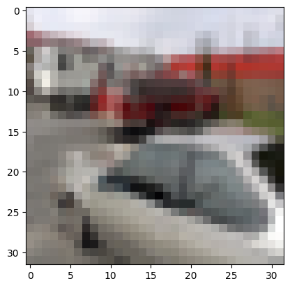
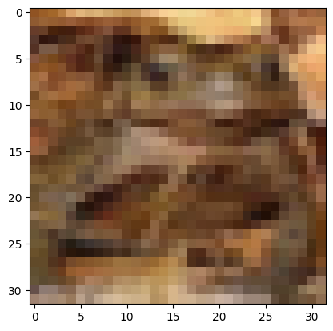
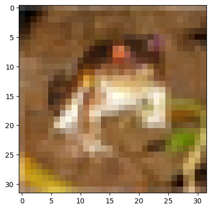
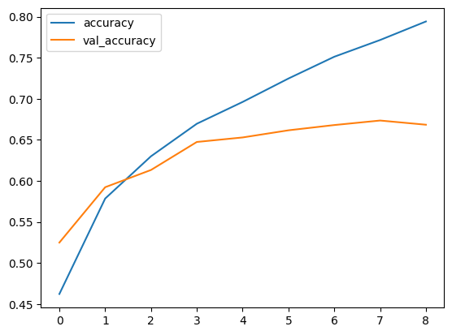
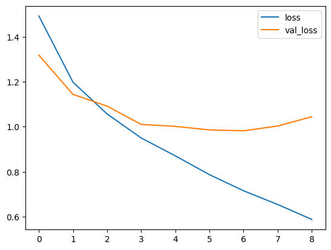
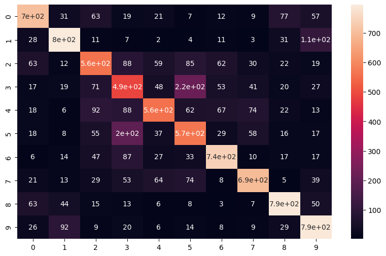
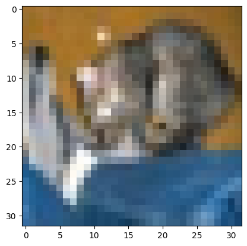

# Convolutional Neural Networks (CNNs) - Coloured Image Data

> Tags: [Data Science], [Machine Learning]
>
> Technical Skills: [Python], [Numpy], [Pandas], [Tensorflow 2], [Keras], [API]
>
> Theoretical Frameworks: [Neural Networks], [Convolutions], [Pooling Layers]

> [!NOTE]
>
>This exercise comes directly from Jose Portilla and his team's fantastic course in Udemy of [Complete Tensorflow 2 and Keras Deep Learning Bootcamp](https://www.udemy.com/course/complete-tensorflow-2-and-keras-deep-learning-bootcamp/).
>
> This was part of the [Workearly](https://www.workearly.gr) bootcamp.

Loading the CIFAR-10 Dataset through Keras API, which consists 32 by 32 coloured images of 10 different objects, and then creating a Machine Learning (CNN) model using Tensorflow 2 that attempts to predict a given image.

## 1. Importing the dataset & model


```python
import pandas as pd
import numpy as np
import matplotlib.pyplot as plt
%matplotlib inline
```


```python
from tensorflow.keras.datasets import cifar10
```


```python
(x_train,y_train),(x_test,y_test) = cifar10.load_data()
```

### Checking the properties of the dataset and the image data


```python
x_train.shape
```


    (50000, 32, 32, 3)


This tells us that there are 50000 pictures, 32x32 pixels, with 3 colour channels (RGB).


```python
x_train[0]
```


    array([[[ 59,  62,  63],
            [ 43,  46,  45],
            [ 50,  48,  43],
            ...,
            [158, 132, 108],
            [152, 125, 102],
            [148, 124, 103]],
    
           [[ 16,  20,  20],
            [  0,   0,   0],
            [ 18,   8,   0],
            ...,
            [123,  88,  55],
            [119,  83,  50],
            [122,  87,  57]],
    
           [[ 25,  24,  21],
            [ 16,   7,   0],
            [ 49,  27,   8],
            ...,
            [118,  84,  50],
            [120,  84,  50],
            [109,  73,  42]],
    
           ...,
    
           [[208, 170,  96],
            [201, 153,  34],
            [198, 161,  26],
            ...,
            [160, 133,  70],
            [ 56,  31,   7],
            [ 53,  34,  20]],
    
           [[180, 139,  96],
            [173, 123,  42],
            [186, 144,  30],
            ...,
            [184, 148,  94],
            [ 97,  62,  34],
            [ 83,  53,  34]],
    
           [[177, 144, 116],
            [168, 129,  94],
            [179, 142,  87],
            ...,
            [216, 184, 140],
            [151, 118,  84],
            [123,  92,  72]]], dtype=uint8)


```python
x_train[0].shape
```


    (32, 32, 3)


[0] is a picture indexed 0, which we can see when we ".shape" by having 32x32 pixels and 3 colour channels. If we are interested about the consistency of the pixels of the image data, it can be observed on its raw form under the result of "x_train[0]." The arrays are combinations of values of colours that make up what we say 32 by 32.

To be more practical, let's show that picture indexed [0] below.


```python
plt.imshow(x_train[0])
```


    <matplotlib.image.AxesImage at 0x1fa22d32e50>


    

    


It's a blurred frog! :)

This can be done with any given number between [0-49999]. 


```python
plt.imshow(x_train[49999])
```


    <matplotlib.image.AxesImage at 0x1fa262117f0>


    

    


```python
plt.imshow(x_train[3567])
```


    <matplotlib.image.AxesImage at 0x1fa2659f340>


    

    


And so on!

## Data Preprocessing


```python
x_train[0].max()
```


    255


This tells us that indeed, the maximum value that a picture can take for any given variable/value within an array is 255, and therefore has the range of [0-255].

With that logic we proceed to scale the model on all it's dimensions by 255.


```python
x_train = x_train/255
```


```python
x_test = x_test/255
```


```python
x_test.shape
```


    (10000, 32, 32, 3)


```python
y_train
```


    array([[6],
           [9],
           [9],
           ...,
           [9],
           [1],
           [1]], dtype=uint8)


The array labels work as continuous values in the network, and if left as such then the CNN would try to predict in a numerical way, which would not be very helpful as it would name a predicted image as '[6]' instead of 'Frog' or 'Car'.

So we need to tackle this as a multi-class classification problem, and one-hot encode it. Technically, converting the labels of the array into categorical data.


```python
from tensorflow.keras.utils import to_categorical
```


```python
y_cat_train = to_categorical(y_train,10)
```


```python
y_cat_test = to_categorical(y_test,10)
```

Making sure that 10 classes are specified within the mapping of the categorical encoding.

To clarify the logic above, within the CIFAR-10 dataset, we know for a fact (by simply [googling](https://www.google.com/search?q=cifar10+label+number+6&client=opera&hs=6y0&sca_esv=acb05f42373aaad6&sca_upv=1&ei=M9fNZvmqDcCrxc8Pz4qTyQw&ved=0ahUKEwi5kMWHppWIAxXAVfEDHU_FJMkQ4dUDCA8&uact=5&oq=cifar10+label+number+6&gs_lp=Egxnd3Mtd2l6LXNlcnAiFmNpZmFyMTAgbGFiZWwgbnVtYmVyIDYyBRAhGKABMgUQIRigAUiEIFC6BFj3HnAGeAGQAQCYAWmgAc8IqgEEMTQuMbgBA8gBAPgBAZgCFaAC9gjCAgoQABiwAxjWBBhHwgIGEAAYFhgewgILEAAYgAQYhgMYigXCAggQABiABBiiBMICCxAAGIAEGJECGIoFwgIFEAAYgATCAgcQIRigARgKmAMAiAYBkAYIkgcEMjAuMaAHsCg&sclient=gws-wiz-serp) it) that frog's label is mapped to 6, and that can be seen when we evaluate the array for image indexed [0]


```python
y_train[0]
```


    array([6], dtype=uint8)


```python
plt.imshow(x_train[0])
```


    <matplotlib.image.AxesImage at 0x1fa2719fee0>


    

    


## Building the ML (CNN) model


```python
from tensorflow.keras.models import Sequential
from tensorflow.keras.layers import Dense, Conv2D, MaxPool2D, Flatten
```


```python
model = Sequential()

# Convolutional Layer (1)
model.add(Conv2D(filters=32, kernel_size=(4,4), input_shape=(32,32,3), activation='relu',))

# Pooling Layer (1)
model.add(MaxPool2D(pool_size=(2,2)))

# Convolutional Layer (2)
model.add(Conv2D(filters=32, kernel_size=(4,4), input_shape=(32,32,3), activation='relu',))

# Pooling Layer (2)
model.add(MaxPool2D(pool_size=(2,2)))

model.add(Flatten())

model.add(Dense(256, activation='relu'))

model.add(Dense(10, activation='softmax'))

model.compile(loss='categorical_crossentropy',optimizer='adam',
              metrics=['accuracy'])
```

    B:\Anaconda\envs\mytfenv\lib\site-packages\keras\src\layers\convolutional\base_conv.py:107: UserWarning: Do not pass an `input_shape`/`input_dim` argument to a layer. When using Sequential models, prefer using an `Input(shape)` object as the first layer in the model instead.
      super().__init__(activity_regularizer=activity_regularizer, **kwargs)
    

The raison d'etre of the two convolutional layers and the two pooling layers, is due to the complexity of the images. The Data load that the model is called to process, is 32*32*3 = 3072.

'relu' refers to *rectified linear unit*, an activation function that helps incorporate nonlinearity in neural networks, and additionally helps tackle the vanishing gradient problem.

'softmax' because we are dealing with a multiclass problem

Also, we will ignore the UserWarning I was just given, because I embrace chaos.


```python
model.summary()
```


<pre style="white-space:pre;overflow-x:auto;line-height:normal;font-family:Menlo,'DejaVu Sans Mono',consolas,'Courier New',monospace"><span style="font-weight: bold">Model: "sequential"</span>
</pre>


<pre style="white-space:pre;overflow-x:auto;line-height:normal;font-family:Menlo,'DejaVu Sans Mono',consolas,'Courier New',monospace">┏━━━━━━━━━━━━━━━━━━━━━━━━━━━━━━━━━━━━━━┳━━━━━━━━━━━━━━━━━━━━━━━━━━━━━┳━━━━━━━━━━━━━━━━━┓
┃<span style="font-weight: bold"> Layer (type)                         </span>┃<span style="font-weight: bold"> Output Shape                </span>┃<span style="font-weight: bold">         Param # </span>┃
┡━━━━━━━━━━━━━━━━━━━━━━━━━━━━━━━━━━━━━━╇━━━━━━━━━━━━━━━━━━━━━━━━━━━━━╇━━━━━━━━━━━━━━━━━┩
│ conv2d (<span style="color: #0087ff; text-decoration-color: #0087ff">Conv2D</span>)                      │ (<span style="color: #00d7ff; text-decoration-color: #00d7ff">None</span>, <span style="color: #00af00; text-decoration-color: #00af00">29</span>, <span style="color: #00af00; text-decoration-color: #00af00">29</span>, <span style="color: #00af00; text-decoration-color: #00af00">32</span>)          │           <span style="color: #00af00; text-decoration-color: #00af00">1,568</span> │
├──────────────────────────────────────┼─────────────────────────────┼─────────────────┤
│ max_pooling2d (<span style="color: #0087ff; text-decoration-color: #0087ff">MaxPooling2D</span>)         │ (<span style="color: #00d7ff; text-decoration-color: #00d7ff">None</span>, <span style="color: #00af00; text-decoration-color: #00af00">14</span>, <span style="color: #00af00; text-decoration-color: #00af00">14</span>, <span style="color: #00af00; text-decoration-color: #00af00">32</span>)          │               <span style="color: #00af00; text-decoration-color: #00af00">0</span> │
├──────────────────────────────────────┼─────────────────────────────┼─────────────────┤
│ conv2d_1 (<span style="color: #0087ff; text-decoration-color: #0087ff">Conv2D</span>)                    │ (<span style="color: #00d7ff; text-decoration-color: #00d7ff">None</span>, <span style="color: #00af00; text-decoration-color: #00af00">11</span>, <span style="color: #00af00; text-decoration-color: #00af00">11</span>, <span style="color: #00af00; text-decoration-color: #00af00">32</span>)          │          <span style="color: #00af00; text-decoration-color: #00af00">16,416</span> │
├──────────────────────────────────────┼─────────────────────────────┼─────────────────┤
│ max_pooling2d_1 (<span style="color: #0087ff; text-decoration-color: #0087ff">MaxPooling2D</span>)       │ (<span style="color: #00d7ff; text-decoration-color: #00d7ff">None</span>, <span style="color: #00af00; text-decoration-color: #00af00">5</span>, <span style="color: #00af00; text-decoration-color: #00af00">5</span>, <span style="color: #00af00; text-decoration-color: #00af00">32</span>)            │               <span style="color: #00af00; text-decoration-color: #00af00">0</span> │
├──────────────────────────────────────┼─────────────────────────────┼─────────────────┤
│ flatten (<span style="color: #0087ff; text-decoration-color: #0087ff">Flatten</span>)                    │ (<span style="color: #00d7ff; text-decoration-color: #00d7ff">None</span>, <span style="color: #00af00; text-decoration-color: #00af00">800</span>)                 │               <span style="color: #00af00; text-decoration-color: #00af00">0</span> │
├──────────────────────────────────────┼─────────────────────────────┼─────────────────┤
│ dense (<span style="color: #0087ff; text-decoration-color: #0087ff">Dense</span>)                        │ (<span style="color: #00d7ff; text-decoration-color: #00d7ff">None</span>, <span style="color: #00af00; text-decoration-color: #00af00">256</span>)                 │         <span style="color: #00af00; text-decoration-color: #00af00">205,056</span> │
├──────────────────────────────────────┼─────────────────────────────┼─────────────────┤
│ dense_1 (<span style="color: #0087ff; text-decoration-color: #0087ff">Dense</span>)                      │ (<span style="color: #00d7ff; text-decoration-color: #00d7ff">None</span>, <span style="color: #00af00; text-decoration-color: #00af00">10</span>)                  │           <span style="color: #00af00; text-decoration-color: #00af00">2,570</span> │
└──────────────────────────────────────┴─────────────────────────────┴─────────────────┘
</pre>


<pre style="white-space:pre;overflow-x:auto;line-height:normal;font-family:Menlo,'DejaVu Sans Mono',consolas,'Courier New',monospace"><span style="font-weight: bold"> Total params: </span><span style="color: #00af00; text-decoration-color: #00af00">225,610</span> (881.29 KB)
</pre>


<pre style="white-space:pre;overflow-x:auto;line-height:normal;font-family:Menlo,'DejaVu Sans Mono',consolas,'Courier New',monospace"><span style="font-weight: bold"> Trainable params: </span><span style="color: #00af00; text-decoration-color: #00af00">225,610</span> (881.29 KB)
</pre>


<pre style="white-space:pre;overflow-x:auto;line-height:normal;font-family:Menlo,'DejaVu Sans Mono',consolas,'Courier New',monospace"><span style="font-weight: bold"> Non-trainable params: </span><span style="color: #00af00; text-decoration-color: #00af00">0</span> (0.00 B)
</pre>


### Creating an early stop


```python
from tensorflow.keras.callbacks import EarlyStopping
```


```python
early_stop = EarlyStopping(monitor='val_loss',patience=2)
```

### Fitting the train data


```python
model.fit(x_train,y_cat_train,epochs=15,
         validation_data=(x_test,y_cat_test),callbacks=[early_stop])
```

    Epoch 1/15
    1563/1563 ━━━━━━━━━━━━━━━━━━━━ 12s 7ms/step - accuracy: 0.3761 - loss: 1.7052 - val_accuracy: 0.5249 - val_loss: 1.3182
    Epoch 2/15
    1563/1563 ━━━━━━━━━━━━━━━━━━━━ 10s 7ms/step - accuracy: 0.5628 - loss: 1.2429 - val_accuracy: 0.5923 - val_loss: 1.1439
    Epoch 3/15
    1563/1563 ━━━━━━━━━━━━━━━━━━━━ 10s 7ms/step - accuracy: 0.6254 - loss: 1.0659 - val_accuracy: 0.6133 - val_loss: 1.0917
    Epoch 4/15
    1563/1563 ━━━━━━━━━━━━━━━━━━━━ 12s 8ms/step - accuracy: 0.6695 - loss: 0.9525 - val_accuracy: 0.6474 - val_loss: 1.0103
    Epoch 5/15
    1563/1563 ━━━━━━━━━━━━━━━━━━━━ 11s 7ms/step - accuracy: 0.6951 - loss: 0.8712 - val_accuracy: 0.6529 - val_loss: 1.0017
    Epoch 6/15
    1563/1563 ━━━━━━━━━━━━━━━━━━━━ 11s 7ms/step - accuracy: 0.7263 - loss: 0.7795 - val_accuracy: 0.6616 - val_loss: 0.9860
    Epoch 7/15
    1563/1563 ━━━━━━━━━━━━━━━━━━━━ 9s 6ms/step - accuracy: 0.7580 - loss: 0.6857 - val_accuracy: 0.6680 - val_loss: 0.9821
    Epoch 8/15
    1563/1563 ━━━━━━━━━━━━━━━━━━━━ 9s 6ms/step - accuracy: 0.7782 - loss: 0.6341 - val_accuracy: 0.6735 - val_loss: 1.0034
    Epoch 9/15
    1563/1563 ━━━━━━━━━━━━━━━━━━━━ 9s 6ms/step - accuracy: 0.8031 - loss: 0.5684 - val_accuracy: 0.6684 - val_loss: 1.0446
    


    <keras.src.callbacks.history.History at 0x1fa272d5cd0>


Default accuracy should be 10% based on the dataset, but as epochs go by, we observe the model becomes better and better at accurately predicting.

The early_stop has finished on 9 epochs, and has returned an accuracy of 80.31% as of the 9th epoch.

## Evaluating the model


```python
metrics = pd.DataFrame(model.history.history)
```


```python
metrics.columns
```


    Index(['accuracy', 'loss', 'val_accuracy', 'val_loss'], dtype='object')


```python
metrics[['accuracy', 'val_accuracy']].plot()
```


    <Axes: >


    

    


```python
metrics[['loss', 'val_loss']].plot()
```


    <Axes: >


    

    


It seems validation loss has started going up since the 6th epoch, so the early stop was correct to stop on the 8th epoch. The trade off for the added accuracy, was desirable.


```python
model.evaluate(x_test,y_cat_test,verbose=0)
```


    [1.0445741415023804, 0.66839998960495]


```python
from sklearn.metrics import classification_report,confusion_matrix
```


```python
predicted_classes = np.argmax(predictions, axis=1)
```


```python
print(classification_report(y_test, predicted_classes))
```

                  precision    recall  f1-score   support
    
               0       0.73      0.70      0.72      1000
               1       0.77      0.80      0.78      1000
               2       0.59      0.56      0.57      1000
               3       0.46      0.49      0.47      1000
               4       0.67      0.56      0.61      1000
               5       0.53      0.57      0.55      1000
               6       0.75      0.74      0.74      1000
               7       0.74      0.69      0.72      1000
               8       0.77      0.79      0.78      1000
               9       0.69      0.79      0.74      1000
    
        accuracy                           0.67     10000
       macro avg       0.67      0.67      0.67     10000
    weighted avg       0.67      0.67      0.67     10000
    
    

The f1-score for accuracy is 67%. Since this data set has 10 classes, then as mentioned earlier, the default prediction should be at 10%, meaning that if you took a random guess, you would have 10% chance to be correct about the category of the image. Therefore, 67% is a good overall performance in accuracy.

Interestingly so, the model we just created, tends to not perform well for the label: 3, which as seen in [CIFAR-10](https://www.cs.toronto.edu/~kriz/cifar.html) it's cats. Funnily enough, we observe the same with label: 5 which is dogs, with f1-scores being very closely aligned (0.47 for label: 3 and 0.55 for label: 5). This could be explained by how limited the quality of the pixels is on 32x32 on depicting a dog or a cat and the computer being able to tell the difference.

Let's test some predictions.


```python
confusion_matrix(y_test,predicted_classes)
```


    array([[704,  31,  63,  19,  21,   7,  12,   9,  77,  57],
           [ 28, 795,  11,   7,   2,   4,  11,   3,  31, 108],
           [ 63,  12, 560,  88,  59,  85,  62,  30,  22,  19],
           [ 17,  19,  71, 487,  48, 217,  53,  41,  20,  27],
           [ 18,   6,  92,  88, 558,  62,  67,  74,  22,  13],
           [ 18,   8,  55, 196,  37, 566,  29,  58,  16,  17],
           [  6,  14,  47,  87,  27,  33, 742,  10,  17,  17],
           [ 21,  13,  29,  53,  64,  74,   8, 694,   5,  39],
           [ 63,  44,  15,  13,   6,   8,   3,   7, 791,  50],
           [ 26,  92,   9,  20,   6,  14,   8,   9,  29, 787]], dtype=int64)


```python
import seaborn as sns

plt.figure(figsize=(10,6))
sns.heatmap(confusion_matrix(y_test,predicted_classes),annot=True)
```


    <Axes: >


    

    


Based on the colouring here, we see indeed that pairs (3,5) and (5,3) which is (cats,dogs) and (dogs,cats) are indeed troublesome as they are more closely correlated by the computer.

To clarify. the lighter the colour of a block (towards 700), it means that the machine predicts that label to be the matching label. For example, all predictions made for pictures labeled 4, the machine likely classified it as 4 indeed, and that's why we see a strong light colour in (4,4) but in any other combination with 4, it is dark (below 100), as it finds no correlation to the other pair.

When we see labels 3 and 5, we see that not only do they get a higher hue in their respective classes (3,3), (5,5) but also that they are a scoring a bit more than 200 in combinations (3,5) and (5,3) meaning the machine is indeed confusing the two categories when it tries to predict.


```python
pred_image = x_test[0]
```


```python
plt.imshow(pred_image)
```


    <matplotlib.image.AxesImage at 0x1fa4a24bd90>


    

    


```python
y_test[0]
```


    array([3], dtype=uint8)


```python
np.argmax(model.predict(pred_image.reshape(1,32,32,3)), axis=-1)
```

    1/1 ━━━━━━━━━━━━━━━━━━━━ 0s 15ms/step
    


    array([3], dtype=int64)


And there we go! 

We took a picture in our test model indexed [0] which is a bit *dubious* as we can see under the image show line, and using the prediction model results to "array[3]" which is the label number for cat, and indeed the picture we see is that of a cat!
